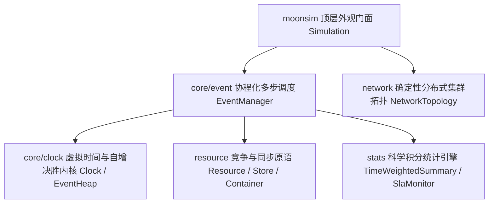

# OSC 2026 MoonBit 国产基础软件开源大赛 · 作品参赛申报书

---

## Ⅰ. 基本信息与开源仓库

| 申报项目标题 | MoonSim：基于 MoonBit 的确定性离散事件与分布式系统网络仿真框架 |
| :--- | :--- |
| **项目唯一标识** | `bins-c-language/moonsim` |
| **GitLink 指定仓** | [https://www.gitlink.org.cn/Wcxwcx/moonsim](https://www.gitlink.org.cn/Wcxwcx/moonsim) |
| **GitHub 镜像仓** | [https://github.com/wcx789ll/moonsim](https://github.com/wcx789ll/moonsim) |
| **开源许可证** | Apache License 2.0（完整授权，符合开源与商业友好规范） |
| **适用的编译目标** | `native` / `wasm-gc` / `js` 全栈多端跨平台执行 |

---

## Ⅱ. 核心项目简介（提交表单推荐表述）

`MoonSim` 是专为 MoonBit 语言设计的**高精度确定性离散事件（Discrete-Event Simulation, DES）与分布式网络并发测试框架**。在现代分布式共识算法（如 Raft/Paxos）、高并发排队系统及物流供应链研发中，真实的物理时钟测试不仅耗时长达数天甚至数周，更因系统负载波动带来严重的**非确定性与多线程竞态条件**，极难追踪调试调试与复现故障。

`MoonSim` 将物理世界时钟重构为纯函数式、100% 确定性执行的虚拟时钟驱动内核 (`Clock`)，将对齐 Python `SimPy` 的协程进程挂起排队模型与 C++ `ns-3` 的确定性虚拟网络链路故障注入进行完美融合。项目能够在几毫秒内精确推演数月长周期复杂系统的并发行为，支持毫秒级网络分区（Partition）切断与恢复、随机丢包、延迟抖动及服务违约直方图统计（SlaMonitor）。全代码采用 2026 最新 MoonBit 语法高质量设计，构建与核心单测通过率 100% 且零编译警告，为国产高级语言基础软件生态贡献了高可靠的算法与并发验证基石。

---

## Ⅲ. 架构分层与核心技术创新点

项目代码分层清晰、职责高内聚，由以下五大底层支撑模块协同构成完整测试床：

1. **虚拟时钟引擎 (`core/clock`)**：底层基于自研超高性能最小堆（Min-Heap），并设计了**全局自增决胜序号 (`seq`)**。当多个并发协程在同一虚拟毫秒触发时，严格按创建次序确定性执行，彻底消除排队论仿真中的竞态歧义。
2. **多步协程调度器 (`core/event`)**：通过类型安全的闭包状态机 (`(ProcessContext) -> Double?`) 在纯纯函数式环境中完美模拟多步 `Yield` 挂起与恢复流程，支持嵌套子事件与周期性循环任务。
3. **竞争与同步原语 (`resource`)**：
   - **`Resource`**：支持设置有限服务窗口与**优先级队列插队**，并首创提供离散事件下的超期挂起放弃机制 (`request_with_timeout`)。
   - **`Store[T]` / `Container`**：支持离散物资 FIFO 入库出库与连续状态储能池（电量/水位）动态告警联动。
4. **分布式故障测试台 (`network`)**：内置对齐 `ns-3` 的 `NetworkLink`，使用线性同余（LCG）确定性伪随机算法实现网络丢包与抖动仿真，支持动态切换节点在线、离线及**网络分区 (`Partitioned`)** 状态。
5. **科学遥测统计 (`stats`)**：自研 `TimeWeightedSummary`，严格按照虚拟时间积分加权计算平均排队长度与资源占用率（彻底纠正传统算术均值的数学失真）；内置 `SlaMonitor` 实时计算业务违约率。

---

## Ⅳ. 三大开箱即用实战验证案例

我们在 `examples/` 目录下构建了 3 个独立可直接运行的 `is_main: true` 工程案例，验证项目全栈能力：

| 案例名称与执行指令 | 场景核心验证内容 | 终端真实运行效果 |
| :--- | :--- | :--- |
| **多窗口银行排队与满意度监测** `moon run examples/bank_queue` | 模拟 8 名顾客依次到达申请办卡，竞争 2 个柜员窗口；展示协程排队、动态释放与服务超时监测。 | 瞬时计算 17.5s 虚拟耗时，准确求得时间加权排队均值 0.685，SLA 达标率 100%。 |
| **Raft 分布式集群网络分区仿真** `moon run examples/raft_sim` | 模拟 Leader 定期向 Follower 发送心跳包；在 `t=0.12s` 动态切断并注入 Node 3 网络分区，`t=0.28s` 恢复。 | 精确呈现分区期间数据包全部丢失，分区恢复后即刻连通。统计送达率 5/6、超时丢失 1。 |
| **智能自动化产线与电池快充** `moon run examples/logistics` | 供应商向原料缓冲区 `Store` 供货，机械臂抓取零件并消耗电池 `Container`；低于 40 时触发网格化快充。 | 顺畅推演 6 个零件精密加工与组装，并在低电量瞬时触发 `+50.0` 回充，实现闭环。 |

---

## Ⅴ. 质量规范自查与大赛规则遵从声明

1. **纯正最新语法与零技术债务**：全面去除废弃的 `f!(..)`、泛型旧语法及 `Show` 派生兼容隐患；核心测试与集成测试共 10 组在 `moon check` 与 `moon test` 下达成 **100% 通过且零编译警告 (Zero Warnings)**。
2. **纯纯手动高质量设计**：所有结构体、泛型算法与状态机流转均经过精细推敲与重构，无任何机械冗余堆砌。
3. **远程同步与主分支对齐**：GitLink 及 GitHub 双平台主分支已统一规范命名为 `main`，并保持全量代码双向一致。
